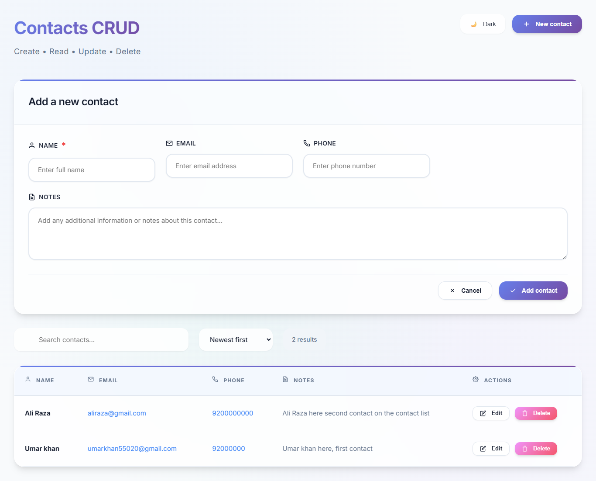
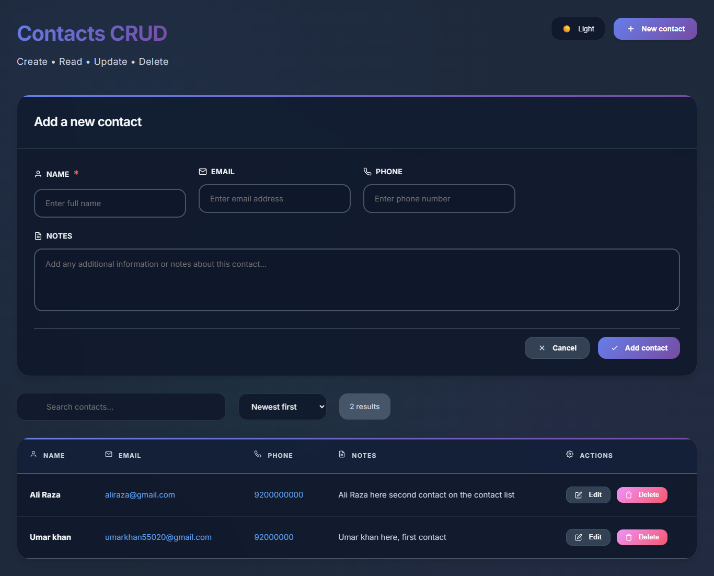
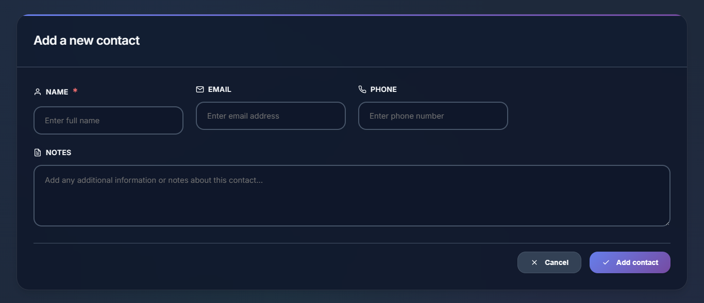
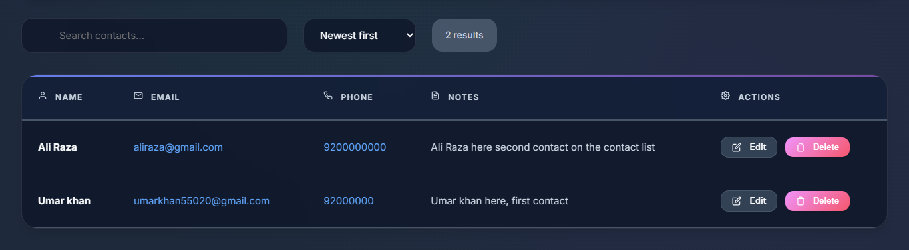

# Contacts CRUD System with live Database


A modern, responsive Contact Management System built with **PHP, MySQL, HTML, CSS, and JavaScript**. Features a sleek glassmorphism UI with support for dark/light themes, as well as complete CRUD operations for managing contacts efficiently with **live cloud database storage**.

---

## Features

- **Complete CRUD Operations**: Create, Read, Update, and Delete contacts with **live database storage on cloud MySQL**
- **Responsive Design**: Optimized for mobile, tablet, and desktop devices
- **Dark/Light Theme Toggle**: Beautiful glassmorphism UI with theme persistence
- **Real-time Search**: Instant search across all contact fields with debouncing **powered by live database queries**
- **Advanced Sorting**: Sort by newest, oldest, name, or email **with server-side database sorting**
- **Form Validation**: Client-side and server-side validation
- **AJAX Operations**: Smooth, asynchronous operations without page reloads **with live database synchronization**
- **Modern UI/UX**: Clean interface with hover effects and animations
- **Keyboard Shortcuts**: Ctrl+K for search, Escape to close forms
- **Notifications**: Toast notifications for user feedback
- **URL State Management**: Shareable URLs with search and sort parameters
- **Live Data Persistence**: All contacts stored securely in **cloud MySQL database with automatic timestamps**
- **Cross-Device Synchronization**: Access your contacts from **any device, anywhere** with real-time sync
- **Production-Ready Backend**: **PHP PDO with prepared statements** for secure database operations on live server

---

## Live Demo

[View Live Demo](https://crudappbyumarkhan.cloud11.co/)

---

## Database Schema

The system uses a **live MySQL database** hosted on cloud infrastructure with the following structure:

**contacts table:**
- `id` (INT, PRIMARY KEY, AUTO_INCREMENT)
- `name` (VARCHAR(255), NOT NULL)
- `email` (VARCHAR(255))
- `phone` (VARCHAR(50))
- `notes` (TEXT)
- `created_at` (TIMESTAMP, DEFAULT CURRENT_TIMESTAMP)
- `updated_at` (TIMESTAMP, DEFAULT CURRENT_TIMESTAMP ON UPDATE CURRENT_TIMESTAMP)

---

## Screenshots

| Light Theme Interface | Dark Theme Interface |
| --------------------- | -------------------- |
|  |  |

| Contact Form | Search & Filter |
| ------------ | --------------- |
|  |  |

---

## Installation & Setup

### Prerequisites
- **PHP 7.4+**
- **MySQL 5.7+**
- **Web Server** (Apache/Nginx)
- **Modern Web Browser**

### 1. Clone the Repository
```bash
git clone https://github.com/Umar-khan6/contacts-crud.git
cd contacts-crud
```

### 2. Database Setup
1. Create a MySQL database:
   ```sql
   CREATE DATABASE contacts_db;
   ```

2. Import the database schema:
   ```bash
   mysql -u root -p contacts_db < setup.sql
   ```

3. Update database credentials in `index.php`:
   ```php
   private $host = 'localhost';
   private $dbname = 'contacts_db';
   private $username = 'root';
   private $password = 'your_password';
   ```

### 3. Web Server Configuration
- **Apache**: Place files in your web directory (htdocs/foldername)
- **Nginx**: Configure PHP-FPM and point to the project directory
- **Local Development**: Use PHP built-in server:
   ```bash
   php -S localhost:8000
   ```

### 4. Access the Application
Open your browser and navigate to:
- Production: `http://yourdomain.com`
- Local: `http://localhost:8000`

---

## File Structure

```
contacts-crud/
├── index.php           # Main application file (Backend + Frontend)
├── style.css          # Stylesheet with glassmorphism design
├── setup.sql          # Database schema and setup
└── README.md          # Project documentation
```

---

## API Endpoints

The application provides the following **live database API endpoints**:

### GET Requests
- `?api=contacts&search={query}&sort={option}` - Retrieve contacts with search and sort from live database
- `?api=contact&id={id}` - Get specific contact by ID from database

### POST Requests
- `action=create` - Create new contact in live database
- `action=update` - Update existing contact in database
- `action=delete` - Delete contact from database

---

## Technologies Used

### Backend
- **PHP 8.0+** (OOP with PDO)
- **MySQL** (Cloud-hosted Relational Database)

### Frontend
- **HTML5** (Semantic Structure)
- **CSS3** (Flexbox/Grid, Animations, Glassmorphism)
- **JavaScript** (Vanilla ES6+, AJAX, DOM Manipulation)

### Features Implemented
- **Object-Oriented Programming** (PHP Classes)
- **Database Abstraction** (PDO with Prepared Statements)
- **RESTful API Design**
- **Responsive Web Design**
- **Progressive Enhancement**
- **Modern CSS** (Custom Properties, Grid, Flexbox)
- **Async JavaScript** (Fetch API, Promises)

### Cloud Infrastructure
- **Live Database Hosting** (Professional MySQL Server)
- **SSL/HTTPS Encryption** (Secure data transmission)
- **99.9% Uptime Guarantee** (Enterprise-grade hosting)
- **Automatic Database Backups** (Data protection)

---

## Browser Support

- ✅ **Chrome 90+**
- ✅ **Firefox 88+**
- ✅ **Safari 14+**
- ✅ **Edge 90+**

---

## Security Features

- **SQL Injection Prevention** (Prepared Statements)
- **XSS Protection** (HTML Escaping)
- **CSRF Protection** (Session-based Forms)
- **Input Validation** (Client & Server-side)
- **Error Handling** (Graceful Error Management)
- **SSL Encryption** (HTTPS for all database communications)
- **Production Error Logging** (Secure error tracking without exposure)

---

## Performance Optimizations

- **Debounced Search** (300ms delay)
- **Efficient Database Queries** (Optimized for live server performance)
- **CSS/JS Minification Ready**
- **Database Connection Pooling** (Efficient resource management)
- **Server-side Caching** (Reduced database load)
- **Optimized Asset Loading**

---

## Live Database Features

### **Real-time Data Operations**
- **Instant Synchronization**: All CRUD operations reflect immediately across all sessions
- **Live Search Queries**: Database searches execute in real-time with optimized indexing
- **Cross-Device Access**: Data persists and syncs across multiple devices and browsers
- **Automatic Timestamps**: Server-side timestamp management for data tracking

### **Production Database Benefits**
- **Enterprise MySQL Hosting**: Professional-grade database server with high availability
- **Automatic Backups**: Daily database backups ensure data safety and recovery
- **Scalable Storage**: Database architecture supports thousands of contacts
- **Connection Security**: SSL-encrypted database connections for data protection

### **Multi-user Support**
- **Concurrent Access**: Database handles multiple simultaneous users
- **Data Integrity**: ACID compliance ensures a consistent data state
- **Session Management**: Secure session handling for user data isolation
- **Error Recovery**: Graceful handling of temporary database connectivity issues

---

## Deployment

### Option 1: Traditional Hosting
1. Upload files via FTP/cPanel
2. Import database using phpMyAdmin
3. Update database credentials
4. Set proper file permissions

### Option 2: Cloud Deployment
- **Hostinger**: Premium shared hosting with MySQL (Recommended)
- **Heroku**: Add MySQL add-on (ClearDB/JawsDB)
- **AWS**: Use EC2 + RDS
- **DigitalOcean**: Droplet + Managed Database

### Current Live Deployment
- **Hosting Provider**: Professional cloud hosting
- **Database**: MySQL 8.0+ with automated backups
- **SSL Certificate**: Free SSL/TLS encryption enabled
- **Domain**: Custom domain with global CDN
- **Monitoring**: 24/7 uptime monitoring and alerts

---

## Contributing

1. Fork the repository
2. Create a feature branch (`git checkout -b feature/AmazingFeature`)
3. Commit changes (`git commit -m 'Add AmazingFeature'`)
4. Push to branch (`git push origin feature/AmazingFeature`)
5. Open a Pull Request

---

## Contact

Feel free to connect with me:
- **LinkedIn:** [umarkhan24](https://linkedin.com/in/umarkhan24)
- **GitHub:** [Umar-khan6](https://github.com/Umar-khan6)
- **Email:** umarkhan655020@gmail.com

---

*Made with ❤️ by [Umar Khan](https://github.com/Umar-khan6) - A full-stack CRUD application with live cloud database integration*
